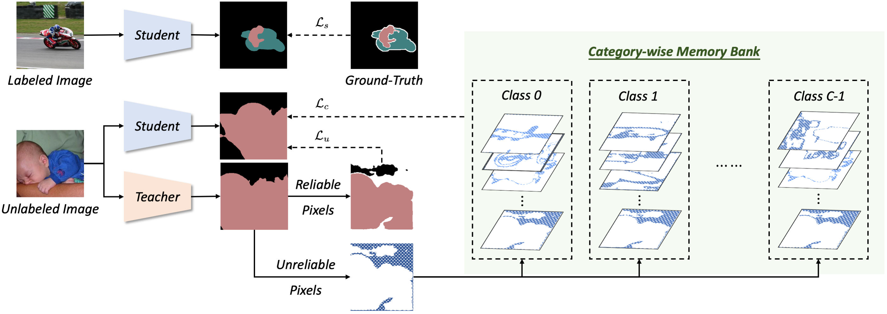

# Using Unreliable Pseudo Labels

Official PyTorch implementation of [Semi-Supervised Semantic Segmentation Using Unreliable Pseudo Labels](https://arxiv.org/abs/2203.03884), CVPR 2022.

Please refer to our **[project page](https://haochen-wang409.github.io/U2PL/)** for qualitative results.

[](https://paperswithcode.com/sota/semi-supervised-semantic-segmentation-on-21?p=semi-supervised-semantic-segmentation-using-2)
[](https://paperswithcode.com/sota/semi-supervised-semantic-segmentation-on-4?p=semi-supervised-semantic-segmentation-using-2)
[](https://paperswithcode.com/sota/semi-supervised-semantic-segmentation-on-9?p=semi-supervised-semantic-segmentation-using-2)
[](https://paperswithcode.com/sota/semi-supervised-semantic-segmentation-on-15?p=semi-supervised-semantic-segmentation-using-2)


> **Abstract.** 
> The crux of semi-supervised semantic segmentation is to assign adequate pseudo-labels to the pixels of unlabeled images. 
> A common practice is to select the highly confident predictions as the pseudo ground-truth, but it leads to a problem that most pixels may be left unused due to their unreliability. 
> We argue that every pixel matters to the model training, even its prediction is ambiguous. 
> Intuitively, an unreliable prediction may get confused among the top classes (*i.e*., those with the highest probabilities), 
> however, it should be confident about the pixel not belonging to the remaining classes. 
> Hence, such a pixel can be convincingly treated as a negative sample to those most unlikely categories. 
> Based on this insight, we develop an effective pipeline to make sufficient use of unlabeled data. 
> Concretely, we separate reliable and unreliable pixels via the entropy of predictions, push each unreliable pixel to a category-wise queue that consists of negative samples, and manage to train the model with all candidate pixels. 
> Considering the training evolution, where the prediction becomes more and more accurate, we adaptively adjust the threshold for the reliable-unreliable partition. 
> Experimental results on various benchmarks and training settings demonstrate the superiority of our approach over the state-of-the-art alternatives.



## Results
### PASCAL VOC 2012

Labeled images are selected from the ```train``` set of original VOC, ```1,464``` images in total. 
And the remaining ```9,118``` images are all considered as unlabeled ones.

For instance, ```1/2 (732)``` represents ```732``` labeled images 
and remaining ```9,850 (9,118 + 732)``` are unlabeled.

| Method                      | 1/16 (92) | 1/8 (183) | 1/4 (366) | 1/2 (732) | Full (1464) |
| --------------------------- | --------- | --------- | --------- | --------- | ----------- |
| SupOnly                     | 45.77     | 54.92     | 65.88     | 71.69     | 72.50       |
| U<sup>2</sup>PL (w/ CutMix) | 67.98     | 69.15     | 73.66     | 76.16     | 79.49       |

Labeled images are selected from the ```train``` set of augmented VOC, ```10,582``` images in total.

Following results are all trained under our own splits.
Training a model on different splits is recommended to measure the performance of a method.
You can train our U<sup>2</sup>PL on splits provided by [CPS](https://github.com/charlesCXK/TorchSemiSeg/tree/main/DATA/pascal_voc/subset_train_aug) or [ST++](https://github.com/LiheYoung/ST-PlusPlus/tree/master/dataset/splits/pascal).

| Method                      | 1/16 (662) | 1/8 (1323) | 1/4 (2646) | 1/2 (5291) |
| --------------------------- | ---------- | ---------- | ---------- | ---------- |
| SupOnly                     | 67.87      | 71.55      | 75.80      | 77.13      |
| U<sup>2</sup>PL (w/ CutMix) | 77.21      | 79.01      | 79.30      | 80.50      |

### Cityscapes

Labeled images are selected from the ```train``` set, ```2,975``` images in total. 

| Method                      | 1/16 (186) | 1/8 (372) | 1/4 (744) | 1/2 (1488) |
| --------------------------- | ---------- | --------- | --------- | ---------- |
| SupOnly                     | 65.74      | 72.53     | 74.43     | 77.83      |
| U<sup>2</sup>PL (w/ CutMix) | 70.30      | 74.37     | 76.47     | 79.05      |
| U<sup>2</sup>PL (w/ AEL)    | 74.90      | 76.48     | 78.51     | 79.12      |

## Checkpoints

- Models on PASCAL VOC 2012 (ResNet101-DeepLabv3+) can be found [here](https://drive.google.com/drive/folders/1_BcixhrEqJEMo3lzKTKPJ_7gCWEjUBWp).

- Models on Cityscapes with AEL (ResNet101-DeepLabv3+)

| 1/16 (186)                                                                                         | 1/8 (372)                                                                                          | 1/4 (744)                                                                                          | 1/2 (1488)                                                                                         |
| -------------------------------------------------------------------------------------------------- | -------------------------------------------------------------------------------------------------- | -------------------------------------------------------------------------------------------------- | -------------------------------------------------------------------------------------------------- |
| [Google Drive](https://drive.google.com/file/d/1IZb9cAKSHajAnWYFHDq_qDecKcJMXvl5/view?usp=sharing) | [Google Drive](https://drive.google.com/file/d/1QyG-qPdjaUZ2qEkQTr70ioLeNDOI943p/view?usp=sharing) | [Google Drive](https://drive.google.com/file/d/1xgIICfZw_5bf-FFH9GtdO_85kQCnQmsT/view?usp=sharing) | [Google Drive](https://drive.google.com/file/d/1IlN5IIUMO4pZ_b_9Xo6659AbUV0dllfM/view?usp=sharing) |
| [Baidu Drive](https://pan.baidu.com/s/1DF9WTiV2mLfY2V9SHP14_w) <br>Fetch Code: rrpd                | [Baidu Drive](https://pan.baidu.com/s/1TjtHQM2tXy0H8b-reXMHJw) <br>Fetch Code: welw                | [Baidu Drive](https://pan.baidu.com/s/1LyecRU6rPbrrxgxy2qI65w) <br>Fetch Code: qwcd                | [Baidu Drive](https://pan.baidu.com/s/1ngb7mS0I6UMj1cff_40cYg) <br>Fetch Code: 4p8r                |


## Installation

```bash
git clone https://github.com/Haochen-Wang409/U2PL.git && cd U2PL
conda create -n u2pl python=3.6.9
conda activate u2pl
pip install -r requirements.txt
pip install pip install torch==1.8.1+cu102 torchvision==0.9.1+cu102 -f https://download.pytorch.org/whl/torch_stable.html
```

## Usage

U<sup>2</sup>PL is evaluated on both Cityscapes and PASCAL VOC 2012 dataset.
### Prepare Data

<details>
  <summary>For Cityscapes</summary>

Download "leftImg8bit_trainvaltest.zip" from: https://www.cityscapes-dataset.com/downloads/

Download "gtFine.zip" from: https://drive.google.com/file/d/10tdElaTscdhojER_Lf7XlytiyAkk7Wlg/view?usp=sharing

Next, unzip the files to folder ```data``` and make the dictionary structures as follows:

```angular2html
data/cityscapes
├── gtFine
│   ├── test
│   ├── train
│   └── val
└── leftImg8bit
    ├── test
    ├── train
    └── val
```

</details>


<details>
  <summary>For PASCAL VOC 2012</summary>

Refer to [this link](https://github.com/zhixuanli/segmentation-paper-reading-notes/blob/master/others/Summary%20of%20the%20semantic%20segmentation%20datasets.md) and download ```PASCAL VOC 2012 augmented with SBD``` dataset.

And unzip the files to folder ```data``` and make the dictionary structures as follows:

```angular2html
data/VOC2012
├── Annotations
├── ImageSets
├── JPEGImages
├── SegmentationClass
├── SegmentationClassAug
└── SegmentationObject
```
</details>

Finally, the structure of dictionary ```data``` should be as follows:

```angular2html
data
├── cityscapes
│   ├── gtFine
│   └── leftImg8bit
├── splits
│   ├── cityscapes
│   └── pascal
└── VOC2012
    ├── Annotations
    ├── ImageSets
    ├── JPEGImages
    ├── SegmentationClass
    ├── SegmentationClassAug
    └── SegmentationObject
```

### Prepare Pretrained Backbone

Before training, please download ResNet101 pretrained on ImageNet-1K from one of the following:
  - [Google Drive](https://drive.google.com/file/d/1nzSX8bX3zoRREn6WnoEeAPbKYPPOa-3Y/view?usp=sharing)
  - [Baidu Drive](https://pan.baidu.com/s/1FDQGlhjzQENfPp4HTYfbeA) Fetch Code: 3p9h

After that, modify ```model_urls``` in ```semseg/models/resnet.py``` to ```</path/to/resnet101.pth>```

### Train a Fully-Supervised Model

For instance, we can train a model on PASCAL VOC 2012 with only ```1464``` labeled data for supervision by:
```bash
cd experiments/pascal/1464/suponly
# use torch.distributed.launch
sh train.sh <num_gpu> <port>

# or use slurm
# sh slurm_train.sh <num_gpu> <port> <partition>
```
Or for Cityscapes, a model supervised by only ```744``` labeled data can be trained by:
```bash
cd experiments/cityscapes/744/suponly
# use torch.distributed.launch
sh train.sh <num_gpu> <port>

# or use slurm
# sh slurm_train.sh <num_gpu> <port> <partition>
```
After training, the model should be evaluated by
```bash
sh eval.sh
```
### Train a Semi-Supervised Model

We can train a model on PASCAL VOC 2012 with ```1464``` labeled data and ```9118``` unlabeled data for supervision by:
```bash
cd experiments/pascal/1464/ours
# use torch.distributed.launch
sh train.sh <num_gpu> <port>

# or use slurm
# sh slurm_train.sh <num_gpu> <port> <partition>
```
Or for Cityscapes, a model supervised by ```744``` labeled data and ```2231``` unlabeled data can be trained by:
```bash
cd experiments/cityscapes/744/ours
# use torch.distributed.launch
sh train.sh <num_gpu> <port>

# or use slurm
# sh slurm_train.sh <num_gpu> <port> <partition>
```
After training, the model should be evaluated by
```bash
sh eval.sh
```

### Train a Semi-Supervised Model on Cityscapes with AEL

First, you should switch the branch:
```bash
git checkout with_AEL
```
Then, we can train a model supervised by ```744``` labeled data and ```2231``` unlabeled data by:
```bash
cd experiments/city_744
# use torch.distributed.launch
sh train.sh <num_gpu> <port>

# or use slurm
# sh slurm_train.sh <num_gpu> <port> <partition>
```
After training, the model should be evaluated by
```bash
sh eval.sh
```

### Note
```<num_gpu>``` means the number of GPUs for training.

To reproduce our results, we recommend you follow the settings:
- Cityscapes: ```4 * V100 (32G)``` for SupOnly and ```8 * V100 (32G)``` for Semi-Supervised
- PASCAL VOC 2012: ```2 * V100 (32G)``` for SupOnly and ```4 * V100 (32G)``` for Semi-Supervised

If you got ```CUDA Out of Memory``` error, please try training our method in [fp16](https://github.com/NVIDIA/apex) mode.
Or, change the ```lr``` in ```config.yaml``` in a linear manner (*e.g.*, if you want to train a SupOnly model on Cityscapes with 8 GPUs, 
you are recommended to change the ```lr``` to ```0.02```).

If you want to train a model on other split, you need to modify ```data_list``` and ```n_sup``` in ```config.yaml```.

Due to the randomness of function ```torch.nn.functional.interpolate``` when ```mode="bilinear"```, 
the results of semantic segmentation will not be the same EVEN IF a fixed random seed is set.

Therefore, we recommend you run 3 times and get the average performance.

## License

This project is released under the [Apache 2.0](LICENSE) license.

## Acknowledgement

The contrastive learning loss and strong data augmentation (CutMix, CutOut, and ClassMix) 
are borrowed from **ReCo**.
We reproduce our U<sup>2</sup>PL based on **AEL** on branch ```with_AEL```.
- ReCo: https://github.com/lorenmt/reco
- AEL: https://github.com/hzhupku/SemiSeg-AEL

Thanks a lot for their great work!

## Citation
```bibtex
@inproceedings{wang2022semi,
    title={Semi-Supervised Semantic Segmentation Using Unreliable Pseudo Labels},
    author={Wang, Yuchao and Wang, Haochen and Shen, Yujun and Fei, Jingjing and Li, Wei and Jin, Guoqiang and Wu, Liwei and Zhao, Rui and Le, Xinyi},
    booktitle={Proceedings of the IEEE/CVF International Conference on Computer Vision and Pattern Recognition (CVPR)},
    year={2022}
}
```

## Contact

- Yuchao Wang, 44442222@sjtu.edu.cn
- Haochen Wang, wanghaochen2022@ia.ac.cn
- Jingjing Fei, feijingjing1@sensetime.com
- Wei Li, liwei1@sensetime.com
